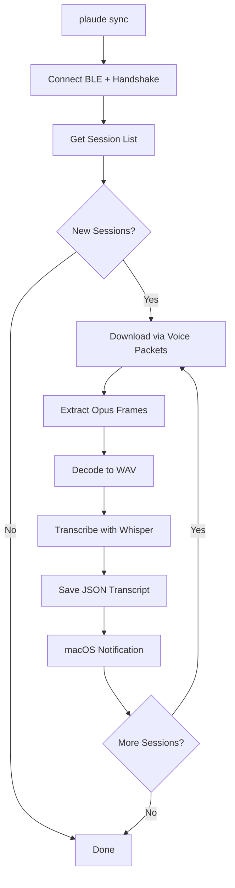
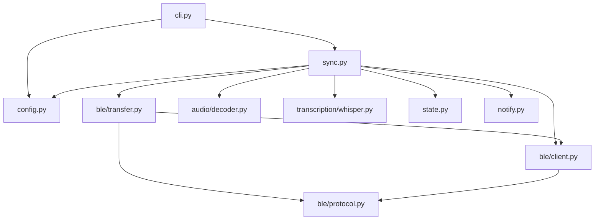
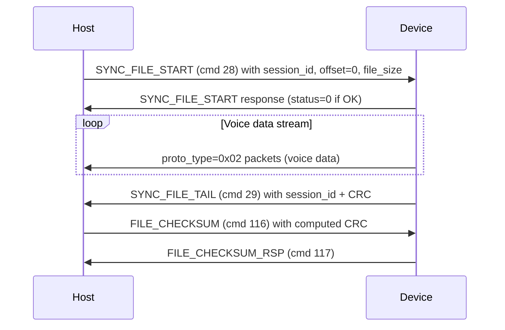

# OpenPlaudit Documentation

Local-first tools for the PLAUD Note AI voice recorder. Includes a Python CLI and a native macOS menubar app. Both connect over Bluetooth Low Energy, download recordings, decode Opus audio, and transcribe locally. The macOS app also records meetings (Teams, Zoom, Webex, FaceTime, Slack) using ScreenCaptureKit and transcribes them with whisper.cpp. No cloud services are involved at any point in the pipeline.

Built as a replacement for PLAUD's proprietary cloud-based workflow, which requires uploading recordings to PLAUD's servers for transcription. OpenPlaudit keeps all data on the local machine and writes transcripts to a configurable directory.

## Design Principles

- **Zero cloud dependency.** BLE download, Opus decoding, and Whisper transcription all happen locally on macOS.
- **Idempotent sync.** Running `plaude sync` multiple times never re-downloads or re-transcribes recordings that have already been processed.
- **Single-command workflow.** The primary use case is `plaude sync`, which performs the entire pipeline in one shot: connect, authenticate, download, decode, transcribe, save, notify.

## Installation

OpenPlaudit requires Python 3.11 or later, macOS (for BLE via CoreBluetooth), and the `libopus` system library.

### Prerequisites

Install the Opus codec library (required by `opuslib`):

```
brew install opus
```

### Install from Source

```
cd openplaudit
python3 -m venv venv
source venv/bin/activate
pip install -e .
```

This installs the `plaude` command into the virtual environment. All dependencies (bleak, opuslib, openai-whisper, click, tomli-w) are resolved automatically by pip from `pyproject.toml`.

### First Run

```
plaude config init
plaude config set device.address "YOUR-DEVICE-UUID"
plaude config set device.token "your_32_char_hex_token_here"
```

The device address is the macOS CoreBluetooth UUID (not a MAC address). The token is the BLE binding token extracted from an iPhone backup; see the Token Extraction section for details.

## CLI Reference

### Global Options

| Option | Description |
|--------|-------------|
| `-v`, `--verbose` | Show BLE packet-level debug output |
| `-q`, `--quiet` | Suppress all output except errors |

### Commands

#### `plaude sync`

The primary command. Connects to the PLAUD device, downloads all new recordings, decodes Opus audio to WAV, transcribes with Whisper, saves JSON transcripts, and sends a macOS notification for each completed recording.

```
plaude sync
plaude -v sync       # with BLE debug output
plaude -q sync       # silent mode
```

The sync pipeline for each recording:

1. Check session state — skip if already synced
2. Download raw Opus data over BLE (voice packet capture)
3. Optionally save raw data to `raw/` directory
4. Extract Opus frames from 89-byte BLE packets
5. Decode frames to 16kHz mono PCM using `opuslib`
6. Write WAV file to `audio/` directory
7. Transcribe WAV with Whisper, producing timestamped JSON
8. Save transcript to `transcripts/` directory
9. Send macOS notification with transcript preview
10. Optionally delete local WAV after transcription



#### `plaude list`

Connects to the device and lists all recordings without downloading.

```
plaude list
```

Example output:

```
2 recording(s):
  [0] 2026-03-12 09:43:58  94.4 KB  scene=1
  [1] 2026-03-12 10:27:08  62.0 KB  scene=1
```

The `session_id` is a Unix timestamp corresponding to when the recording started. `file_size` is the raw Opus frame data size (the actual BLE transfer is approximately 11% larger due to 9-byte per-frame headers). `scene` indicates the recording mode (1 = standard).

#### `plaude scan`

Scans for PLAUD BLE devices in range. Does not require any configuration.

```
plaude scan
plaude scan --timeout 30     # longer scan
```

The scan first searches by the PLAUD service UUID (`0x1910`). If no devices are found, it falls back to a broader scan looking for Nordic Semiconductor manufacturer data (`0x0059`) or device names containing "plaud".

#### `plaude transcribe <file>`

Transcribes a local audio file (WAV, MP3, FLAC, or any format Whisper supports) without connecting to the device.

```
plaude transcribe recording.wav
plaude transcribe recording.wav --output /path/to/transcripts
```

#### `plaude config`

Configuration management subcommands.

| Subcommand | Description |
|------------|-------------|
| `plaude config init` | Create a default config file at `~/.config/openplaudit/config.toml` |
| `plaude config show` | Display the current effective configuration (defaults merged with user overrides) |
| `plaude config set <key> <value>` | Set a configuration value using dotted notation (e.g. `device.address`) |

## Configuration

### Config File

The configuration file is located at `~/.config/openplaudit/config.toml`. It is created by `plaude config init` with default values.

```toml
[device]
address = "YOUR-DEVICE-UUID"
token = "your_32_char_hex_token_here"

[output]
base_dir = "~/Documents/OpenPlaudit"

[transcription]
model = "medium"
language = "en"

[sync]
auto_delete_local_audio = false
keep_raw = false

[notifications]
enabled = true
show_preview = true
```

### Configuration Keys

#### `[device]`

| Key | Type | Description |
|-----|------|-------------|
| `address` | string | macOS CoreBluetooth UUID for the PLAUD device |
| `token` | string | 32-character hex BLE binding token |

#### `[output]`

| Key | Type | Default | Description |
|-----|------|---------|-------------|
| `base_dir` | string | `~/Documents/OpenPlaudit` | Root directory for all output. Subdirectories `audio/`, `transcripts/`, and `raw/` are created automatically |

#### `[transcription]`

| Key | Type | Default | Description |
|-----|------|---------|-------------|
| `model` | string | `medium` | Whisper model size. Options: `tiny`, `base`, `small`, `medium`, `large` |
| `language` | string | `en` | Language hint for Whisper. Set to empty string for auto-detection |

#### `[sync]`

| Key | Type | Default | Description |
|-----|------|---------|-------------|
| `auto_delete_local_audio` | bool | `false` | Delete local WAV file after transcription completes |
| `keep_raw` | bool | `false` | Retain raw BLE download (Opus with packet headers) in `raw/` directory |

#### `[notifications]`

| Key | Type | Default | Description |
|-----|------|---------|-------------|
| `enabled` | bool | `true` | Send macOS notifications on sync completion |
| `show_preview` | bool | `true` | Include first 100 characters of transcript in the notification |

### State File

Sync state is tracked separately from configuration at `~/.local/share/openplaudit/state.json`. This file records which sessions have been downloaded, decoded, transcribed, and failed, using the session ID (Unix timestamp) as the key.

```json
{
  "1773294238": {
    "downloaded_at": "2026-03-12T06:31:41.190258+00:00",
    "decoded_at": "2026-03-12T06:31:42.010000+00:00",
    "transcribed_at": "2026-03-12T06:31:46.259197+00:00"
  }
}
```

### Output Directory Structure

```
~/Documents/OpenPlaudit/
  audio/
    20260312_094358.wav     # Decoded 16kHz mono WAV
    20260312_102708.wav
  transcripts/
    20260312_094358.json    # Timestamped JSON transcript
    20260312_102708.json
  raw/                      # Only if keep_raw = true
    20260312_094358.opus    # Raw BLE download with packet headers
```

## Transcript Format

Each transcript is a JSON file with timestamped segments.

```json
{
  "file": "20260312_094358",
  "duration_seconds": 23.0,
  "model": "medium",
  "language": "en",
  "segments": [
    {
      "start": 0.0,
      "end": 12.0,
      "text": "First segment of transcribed speech..."
    },
    {
      "start": 12.0,
      "end": 21.0,
      "text": "Second segment continues here..."
    }
  ],
  "text": "Full concatenated transcript..."
}
```

| Field | Type | Description |
|-------|------|-------------|
| `file` | string | Filename stem derived from session timestamp (`YYYYMMDD_HHMMSS`) |
| `duration_seconds` | float | Total audio duration in seconds (from WAV header) |
| `model` | string | Whisper model used for transcription |
| `language` | string | Detected or specified language code |
| `segments` | array | Timestamped transcript segments with `start`, `end`, and `text` |
| `text` | string | Full concatenated transcript |

## Architecture

### Package Structure

```
src/plaude/
  __init__.py                 # Package version
  cli.py                      # Click CLI entry point
  config.py                   # TOML config load/save/defaults
  sync.py                     # Orchestrator: download > decode > transcribe
  state.py                    # JSON session tracker
  notify.py                   # macOS notifications via osascript
  ble/
    __init__.py
    protocol.py               # Packet building, CRC, constants
    client.py                 # PlaudClient: BLE connect/handshake/sessions
    transfer.py               # File download via voice packet capture
  audio/
    __init__.py
    decoder.py                # Opus frame extraction + decode to WAV
  transcription/
    __init__.py
    whisper.py                # Whisper model wrapper
```

### Module Dependency Graph



### Dependencies

| Package | Version | Purpose |
|---------|---------|---------|
| `bleak` | >= 0.22 | BLE communication via CoreBluetooth |
| `opuslib` | >= 3.0 | Opus audio decoding (requires system `libopus`) |
| `openai-whisper` | >= 20231117 | Local speech-to-text transcription |
| `click` | >= 8.0 | CLI framework |
| `tomli-w` | >= 1.0 | TOML writing (reading uses stdlib `tomllib`) |

## BLE Protocol Reference

This section documents the PLAUD Note BLE protocol as reverse-engineered from the Android SDK and validated against the real device.

### GATT Service

The PLAUD custom service uses UUID `0x1910` with two characteristics:

| Characteristic | UUID | Direction | Properties |
|----------------|------|-----------|------------|
| TX | `0x2BB0` | Device to host | Notify |
| RX | `0x2BB1` | Host to device | Write |

### Packet Format

All command packets share a common header:

```
[proto_type: uint8] [cmd_id: uint16 LE] [payload...]
```

| proto_type | Meaning |
|------------|---------|
| `0x01` | Command (request/response) |
| `0x02` | Voice data (file transfer) |
| `0x03` | OTA update |

### Authentication

The handshake uses a 32-byte binding token, zero-padded from the hex string representation. This token is set during initial device binding through the PLAUD cloud API and is not the device serial number.

**Handshake request payload:**

```
[0x02]            handshake type
[0x00]            config value
[0x00]            extra byte (portVersion >= 3)
[token: 32 bytes] UTF-8 encoded hex token, zero-padded
```

**Handshake response:**

| Byte | Field | Values |
|------|-------|--------|
| 0 | status | 0 = success, 1 = TOKEN_NOT_MATCH, 2 = RECORDING_NOW, 255 = MODE_NOT_MATCH |
| 1-2 | portVersion | uint16 LE (observed: 10) |
| 3 | timezone | |
| 4 | timezoneMin | |
| 5 | audioChannel | |
| 6 | supportWifi | |

### Session Listing

Command `GET_REC_SESSIONS` (cmd 26) returns:

```
[4 bytes unused] [count: uint32 LE]
Then count * 10-byte entries:
  [session_id: uint32 LE]  — Unix timestamp of recording start
  [file_size: uint32 LE]   — Raw Opus frame data size (without BLE headers)
  [scene: uint16 LE]       — Recording mode (1 = standard)
```

### File Transfer

File transfer uses the voice packet capture approach. The sequence:



The voice data packets arrive as BLE notifications with `proto_type=0x02`. The host strips the protocol byte and concatenates the remaining bytes. The resulting data stream consists of 89-byte packets, each containing a 9-byte header and an 80-byte Opus frame.

The device sends `0xFFFF` as the CRC value in SYNC_FILE_TAIL for voice-mode transfers, indicating that CRC verification should be skipped. The host still computes and sends its own CRC in FILE_CHECKSUM for protocol completeness.

### Audio Data Format

The raw BLE transfer data consists of fixed-size 89-byte packets:

```
[session_id: 4 bytes LE]  — uint32, same for all packets in a file
[offset: 4 bytes LE]      — uint32, byte offset of this frame's PCM data
[frame_size: 1 byte]      — actual Opus frame size (typically 80, but can vary)
[opus_frame: 80 bytes]    — Opus-encoded audio (padded if frame_size < 80)
```

Each Opus frame represents 20ms of 16kHz mono audio (320 PCM samples). A typical 24-second recording contains approximately 1,200 frames.

The `file_size` reported by `GET_REC_SESSIONS` represents the raw Opus frame bytes only (i.e. `frame_count * 80`). The actual BLE transfer is larger by a factor of 89/80 due to the 9-byte per-frame headers.

### CRC Algorithm

File integrity verification uses CRC-16/CCITT-FALSE:

- Polynomial: `0x1021`
- Initial value: `0xFFFF`
- No final XOR
- No bit reversal

Known test vector: `CRC("123456789") = 0x29B1`.

## Token Extraction

The BLE binding token is not the device serial number. For a production-bound device, the token was set during the initial binding through the PLAUD cloud API. To extract it from an existing iPhone backup:

1. Create an **unencrypted** iPhone backup using Finder or Apple Configurator.
2. Search the backup's plist and SQLite databases for the PLAUD app's stored BLE token.
3. The token is a 32-character hex string (e.g. `00112233445566778899aabbccddeeff`).
4. Configure it with `plaude config set device.token <token>`.

Alternatively, the device can be factory-reset and re-bound with a known token, though this loses cloud-side data.

## Testing

### Unit Tests

The test suite covers protocol serialisation, audio frame extraction, configuration management, state tracking, BLE transfer validation, CLI commands, sync orchestration, and retry/resume semantics. BLE integration is tested manually against the real device.

```
source venv/bin/activate
python -m pytest tests/ -v
```

| Test Module | Coverage |
|-------------|----------|
| `test_protocol.py` | Packet building, CRC-16 known vectors, session parsing |
| `test_decoder.py` | Frame extraction from 89-byte packets, variable frame sizes, boundary conditions |
| `test_config.py` | Load/save roundtrip, deep merge, init idempotency, dotted-key set with type coercion, corrupt config quarantine |
| `test_state.py` | State persistence, phase markers, full lifecycle, corrupt state quarantine |
| `test_transfer.py` | No-head, rejected transfer, malformed tail, CRC mismatch, size/alignment validation |
| `test_cli.py` | CLI commands via CliRunner, error handling, verbose/quiet flags |
| `test_sync_orchestration.py` | Config validation, skip-complete, failure recording |
| `test_retry_resume.py` | Retry after failure at each phase, multi-session resume, failure clearing |

### Manual End-to-End Test

1. `plaude scan` — confirms device discovery
2. `plaude list` — confirms BLE authentication and session enumeration
3. `plaude sync` — confirms download, decode, transcribe, and notify
4. `plaude sync` (again) — confirms idempotent skip of already-synced recordings
5. Verify transcript JSON files in `~/Documents/OpenPlaudit/transcripts/`
6. Verify macOS notification appeared

## Troubleshooting

**"Handshake failed"**: The binding token is incorrect, or the device is currently recording. Stop any active recording and verify the token with `plaude config show`.

**"No PLAUD devices found"**: Ensure the device is powered on, not connected to the PLAUD app on another device, and within BLE range. The PLAUD Note does not advertise while connected to another host.

**Whisper out-of-memory**: The `medium` model requires approximately 5 GB of RAM. For constrained environments, set `plaude config set transcription.model small` or `base`.

**opuslib import error**: The `libopus` system library must be installed (`brew install opus`). The Python `opuslib` package is a thin ctypes wrapper that loads `libopus.dylib` at runtime.

**Download stalls**: BLE transfer speed is approximately 20-30 KB/s. A 100 KB recording takes about 5 seconds. If the transfer stalls for more than 10 seconds, the download is aborted. Move closer to the device and retry.
